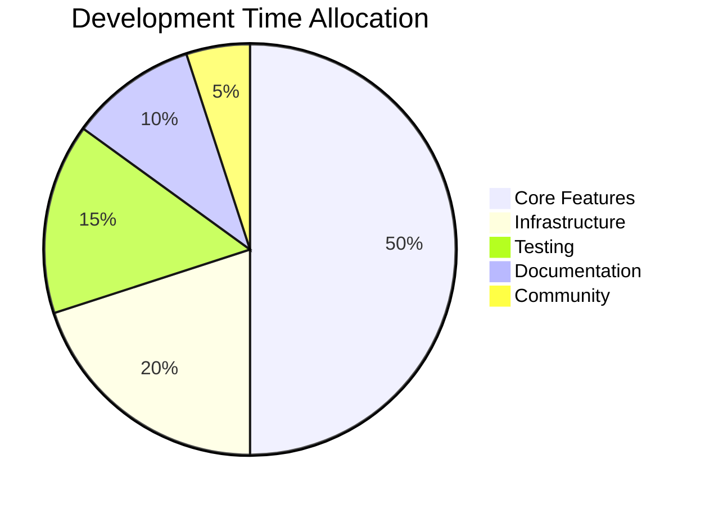
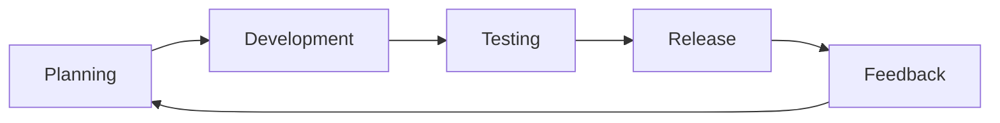
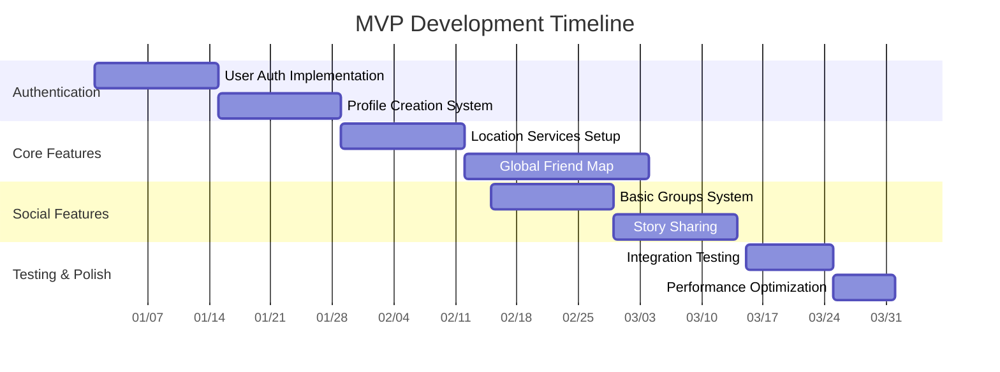
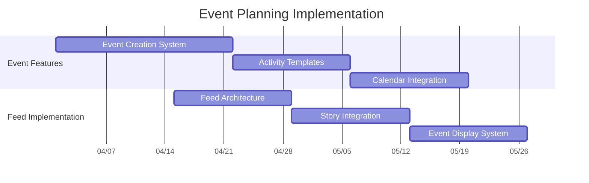
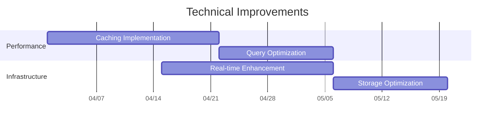
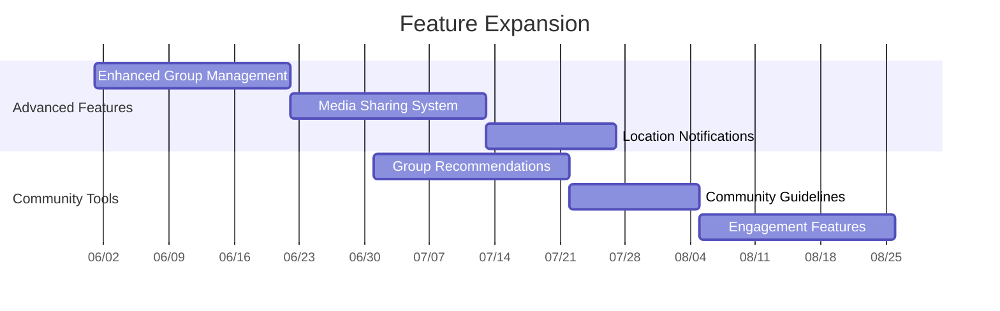
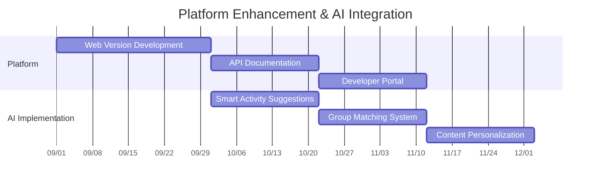

# Veni Vidi Project Playbook
*"I came, I saw, I connected"*

## 1. Profile & Vision

### Why We Exist
In today's interconnected world, two distinct challenges have emerged:
1. Travelers form meaningful connections globally but struggle to maintain them once they return home
2. People with diverse social circles find it increasingly difficult to maintain quality relationships across multiple friend groups

Traditional social networks fail to address these unique dynamics. Veni Vidi bridges this gap by creating an activity-centered platform that makes maintaining meaningful connections natural and effortless.

### Our Mission
To revolutionize how people maintain and strengthen their social connections through shared experiences and activities, making the world feel more connected and accessible - whether you're a global traveler or managing local friend groups.

### Who We Serve

#### Primary Segments

1. **Global Connectors (25-40)**
   - Frequent travelers (4+ trips/year)
   - Digital nomads & expats
   - International professionals
   - Key Needs:
     * Maintaining travel connections
     * Finding local experiences
     * Building global communities

2. **Social Orchestrators (25-45)**
   - Multiple friend groups
   - Activity organizers
   - Community builders
   - Key Needs:
     * Coordinating group activities
     * Managing different social circles
     * Maintaining consistent connections

### Our Differentiation

| Feature | Traditional Social Networks | Standard Event Apps | Veni Vidi |
|---------|---------------------------|-------------------|-----------|
| Social Model | Static connections | Event-based only | Activity-centered relationships |
| Group Management | Basic groups | Temporary events | Smart circles with context |
| Location Features | Check-ins | Event locations | Real-time activity matching |
| Privacy Model | Binary (friends/non-friends) | Public/Private | Context-based privacy |
| Connection Building | Following/Friending | Event attendance | Shared experiences |
| Activity Organization | Basic events | Structured events | Flexible activity types |

### Core Values

1. **Meaningful Connections**
   - Quality over quantity
   - Context-rich relationships
   - Real-world interactions

2. **Seamless Organization**
   - Effortless activity planning
   - Smart group management
   - Intuitive interaction

3. **Cultural Bridge-Building**
   - Cross-cultural understanding
   - Global-local connection
   - Inclusive communities

4. **Privacy-First**
   - Contextual privacy
   - Data protection
   - User control

## 2. Technical Foundation

### Architecture Overview

#### Frontend Stack
1. **Core Framework**
   - React Native with Expo
     * Cross-platform consistency
     * Rapid development
     * OTA updates
     * Native performance

2. **UI Framework**
   - NativeWind (Tailwind CSS for React Native)
   - shadcn/ui components
   - Lucide React Native icons

3. **Essential Libraries**
   ```typescript
   // Key dependencies
   {
     "expo": "~50.0.0",
     "react-native": "0.73.0",
     "nativewind": "^4.0.0",
     "@tanstack/react-query": "^5.0.0",
     "i18next": "^23.0.0",
     "react-hook-form": "^7.0.0",
     "@react-navigation/native": "^6.0.0",
     "zod": "^3.0.0"
   }
   ```

#### Backend Services (Supabase)

1. **Core Services**
   ```mermaid
   graph TB
     A[Supabase Platform] --> B[Authentication]
     A --> C[PostgreSQL Database]
     A --> D[Real-time]
     A --> E[Storage]
     A --> F[Edge Functions]
     A --> G[Vector Search]
   ```

2. **Data Model**
   ```sql
   -- Example of core tables
   CREATE TABLE profiles (
     id UUID REFERENCES auth.users PRIMARY KEY,
     username TEXT UNIQUE,
     full_name TEXT,
     avatar_url TEXT,
     metadata JSONB,
     created_at TIMESTAMPTZ DEFAULT NOW()
   );

   CREATE TABLE activities (
     id UUID DEFAULT gen_random_uuid() PRIMARY KEY,
     creator_id UUID REFERENCES profiles(id),
     title TEXT,
     type TEXT,
     location GEOGRAPHY(POINT),
     start_time TIMESTAMPTZ,
     metadata JSONB,
     created_at TIMESTAMPTZ DEFAULT NOW()
   );

   CREATE TABLE social_circles (
     id UUID DEFAULT gen_random_uuid() PRIMARY KEY,
     name TEXT,
     owner_id UUID REFERENCES profiles(id),
     type TEXT,
     metadata JSONB,
     created_at TIMESTAMPTZ DEFAULT NOW()
   );
   ```

## 3. Resources & Team Structure

### Initial Phase (0-6 months)
1. **Solo Founder Structure**
   - Full-stack development
   - Product management
   - Initial UX design
   - Development prioritization

2. **External Resources**
   - UI/UX Consultation (as needed)
   - Legal/Compliance (contracted)
   - Technical Documentation (automated/AI-assisted)
   - Community Management (part-time)

3. **Development Distribution**


### Growth Phase (6-18 months)
1. **Priority Hires**
   - Senior Mobile Developer
   - UX Designer
   - Community Manager
   - Growth Marketer

2. **Outsourced Functions**
   - Quality Assurance
   - Content Moderation
   - Customer Support
   - Analytics

## 4. Process & Implementation

### Development Approach

#### Sprint Structure (2-week cycles)


1. **Solo Development Workflow**
   - Morning: Feature development (4h)
   - Afternoon: Testing & refinement (2h)
   - Evening: Planning & documentation (2h)

2. **Feature Implementation Process**
   ```typescript
   interface FeatureImplementation {
     planning: {
       userStories: string[];
       technicalRequirements: string[];
       testCriteria: string[];
     };
     development: {
       timeEstimate: number;
       dependencies: string[];
       priority: 'high' | 'medium' | 'low';
     };
     testing: {
       unitTests: boolean;
       integrationTests: boolean;
       userTesting: boolean;
     };
   }
   ```

### MVP Feature Prioritization Matrix

| Feature | Complexity | Impact | Priority | Timeline |
|---------|------------|--------|----------|----------|
| Global Friend Map | High | High | P0 | Month 1-2 |
| Basic Profiles | Low | High | P0 | Month 1 |
| Location Services | High | High | P0 | Month 1-2 |
| Story Sharing | Medium | Medium | P1 | Month 2-3 |
| Group Management | Medium | High | P1 | Month 2-3 |

## 5. Product Roadmap

### Phase 1: Foundation (Months 1-3)
Core feature implementation and essential functionality establishment.



**Key Deliverables:**
- Complete authentication system
- User profile management
- Location tracking and visualization
- Basic group functionality
- Story sharing mechanism
- Essential privacy controls

### Phase 2: Experience Enhancement (Months 4-5)
Focus on event planning tools and technical infrastructure.





**Key Deliverables:**
- Complete event planning system
- Activity feed implementation
- Enhanced real-time capabilities
- Optimized performance metrics
- Improved data management

### Phase 3: Community Growth (Months 6-8)
Expanding social features and community engagement.



**Key Deliverables:**
- Advanced group management features
- Enhanced media sharing capabilities
- Smart notification system
- Community engagement tools
- Group recommendation engine
- Moderation tools

### Phase 4: Platform Evolution (Months 9-12)
Platform expansion and AI integration.



**Key Deliverables:**
- Web platform launch
- Complete API documentation
- Developer tools and SDK
- AI-powered activity suggestions
- Smart group matching
- Personalized content delivery
- Advanced analytics integration

### Success Criteria for Each Phase

**Phase 1:**
- Authentication success rate > 99%
- Location tracking accuracy < 10m
- Story sharing latency < 2s

**Phase 2:**
- Event creation completion rate > 80%
- Feed loading time < 1s
- Cache hit rate > 90%

**Phase 3:**
- Group engagement rate > 40%
- Media sharing success rate > 98%
- Notification engagement > 25%

**Phase 4:**
- AI suggestion accuracy > 85%
- Cross-platform sync < 500ms
- API uptime > 99.9%

Would you like me to:
1. Add more detailed technical specifications for any phase?
2. Create sub-task breakdowns for specific features?
3. Expand on the success criteria?
4. Add risk mitigation strategies for each phase?`


## 6. Success Metrics

### Key Performance Indicators

1. **User Engagement**
   ```typescript
   interface EngagementMetrics {
     dailyActiveUsers: number;
     averageSessionDuration: number;
     featureUsage: {
       mapViews: number;
       storiesCreated: number;
       groupsFormed: number;
     };
     retentionRates: {
       day1: number;
       day7: number;
       day30: number;
     };
   }
   ```

2. **Technical Performance**
   - API response time < 200ms
   - App crash rate < 0.1%
   - Real-time sync delay < 500ms
   - Storage usage optimization

3. **Growth Metrics**
   - Monthly user growth > 20%
   - Feature adoption rate > 40%
   - Group creation rate
   - Activity participation rate

## 7. Risk Management

### Technical Risks & Mitigation

1. **Scalability Challenges**
   ```typescript
   interface ScalabilityMitigation {
     monitoring: {
       supabaseMetrics: boolean;
       customMetrics: boolean;
       alertThresholds: number[];
     };
     optimization: {
       queryOptimization: boolean;
       caching: boolean;
       loadBalancing: boolean;
     };
   }
   ```

2. **Data Privacy & Security**
   - Regular security audits
   - Data encryption at rest
   - Privacy-first architecture
   - GDPR/CCPA compliance

### Business Risks & Mitigation

1. **Market Adoption**
   - Beta testing program
   - Community-driven development
   - Feature validation process

2. **Resource Constraints**
   - Automated testing
   - CI/CD implementation
   - Documentation automation

## 8. Monetization Strategy

### Phase 1: Growth Focus (Months 1-12)
- Free core features
- Focus on user acquisition
- Community building

### Phase 2: Revenue Introduction (Months 13+)

1. **Freemium Model**
   ```typescript
   interface PricingTiers {
     free: {
       features: string[];
       limits: Record<string, number>;
     };
     premium: {
       features: string[];
       price: number;
       benefits: string[];
     };
     business: {
       features: string[];
       price: number;
       customization: boolean;
     };
   }
   ```

2. **Revenue Streams**
   - Premium features
   - percentage on professional event's sales
   - Group upgrades
   - API access
   - Partner integrations
